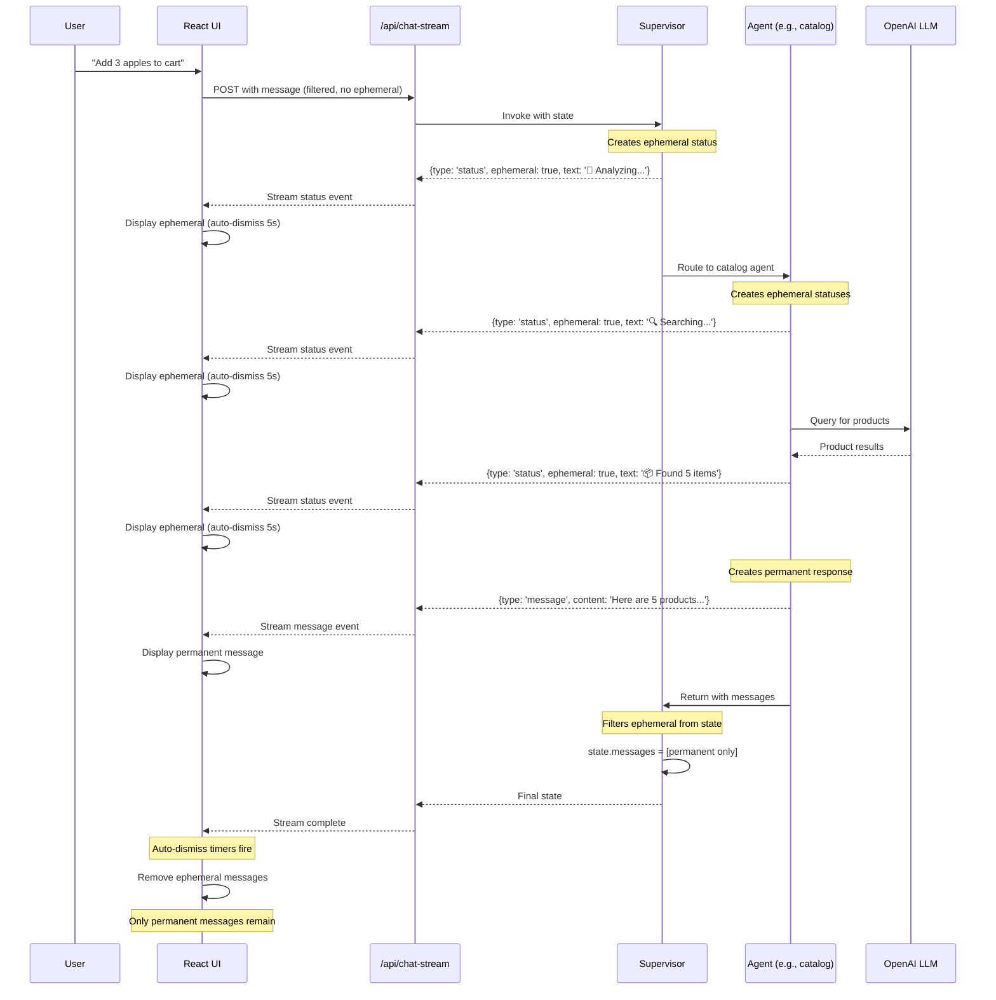

## Component Architecture

```
┌─────────────────────────────────────────────────────────────────┐
│                        React Application                         │
│  ┌─────────────────────────────────────────────────────────┐   │
│  │  useStreamingChat Hook                                   │   │
│  │  • Parses NDJSON stream                                 │   │
│  │  • Handles message/status/error events                  │   │
│  │  • Schedules auto-removal of ephemeral                  │   │
│  │  • Filters ephemeral before sending to backend          │   │
│  └─────────────────────────────────────────────────────────┘   │
│                            ▲  │                                  │
│                            │  ▼                                  │
│  ┌─────────────────────────────────────────────────────────┐   │
│  │  ChatWindow Component                                    │   │
│  │  • Displays messages (permanent + ephemeral)            │   │
│  │  • Visual distinction for ephemeral                     │   │
│  │  • Auto-scroll to latest                                │   │
│  └─────────────────────────────────────────────────────────┘   │
└─────────────────────────────────────────────────────────────────┘
                              ▲  │
                              │  │ NDJSON Stream
                              │  ▼
┌─────────────────────────────────────────────────────────────────┐
│                    /api/chat-stream Route                        │
│  ┌─────────────────────────────────────────────────────────┐   │
│  │  Stream Processor                                        │   │
│  │  • isStatusLike() - Detects status messages             │   │
│  │  • isEphemeralChunk() - Checks ephemeral marker         │   │
│  │  • extractReadableTexts() - Extracts content            │   │
│  │  • Emits typed events: {type, payload}                  │   │
│  └─────────────────────────────────────────────────────────┘   │
└─────────────────────────────────────────────────────────────────┘
                              ▲  │
                              │  ▼
┌─────────────────────────────────────────────────────────────────┐
│                       LangGraph Workflow                         │
│  ┌─────────────────────────────────────────────────────────┐   │
│  │  Supervisor Node                                         │   │
│  │  • createProgressMessage() - Creates ephemeral status   │   │
│  │  • Routes to specialized agents                         │   │
│  │  • Filters ephemeral from state.messages               │   │
│  └─────────────────────────────────────────────────────────┘   │
│                            │  ▲                                  │
│                            ▼  │                                  │
│  ┌─────────────────────────────────────────────────────────┐   │
│  │  Agent Nodes (catalog, cart, deals, etc.)              │   │
│  │  • createStatusEmitter() - Emits typed status messages  │   │
│  │  • StatusTemplates - Consistent messages                │   │
│  │  • Returns ephemeral + permanent messages               │   │
│  └─────────────────────────────────────────────────────────┘   │
│                                                                  │
│  ┌─────────────────────────────────────────────────────────┐   │
│  │  SupervisorState                                         │   │
│  │  • messages: Annotation with reducer                    │   │
│  │  • Filters: !msg.progress?.ephemeral                    │   │
│  │  • Keeps only last 10 permanent messages                │   │
│  └─────────────────────────────────────────────────────────┘   │
└─────────────────────────────────────────────────────────────────┘
```

## Message Flow Through System

```
┌──────────────────────────────────────────────────────────────┐
│ 1. Agent Emits Messages                                      │
├──────────────────────────────────────────────────────────────┤
│                                                              │
│  const status = createStatusEmitter('catalog');              │
│  const messages = [                                          │
│    status.emit('🔍 Searching...'),    // ephemeral=true     │
│    status.emit('📦 Found 5 items'),   // ephemeral=true     │
│    permanentResponse                  // ephemeral=false    │
│  ];                                                          │
│                                                              │
│  Each message has structure:                                 │
│  {                                                           │
│    message: AIMessage,                                       │
│    agent: 'catalog',                                         │
│    progress: {                                               │
│      isProgressUpdate: true,                                 │
│      ephemeral: true,          ← KEY MARKER                 │
│      autoRemoveMs: 5000                                      │
│    }                                                         │
│  }                                                           │
└──────────────────────────────────────────────────────────────┘
                         │
                         ▼
┌──────────────────────────────────────────────────────────────┐
│ 2. Supervisor State Reducer Filters                          │
├──────────────────────────────────────────────────────────────┤
│                                                              │
│  messages: Annotation({                                      │
│    reducer: (x, y) => {                                      │
│      const combined = x.concat(y);                           │
│      const permanent = combined.filter(msg =>                │
│        !msg.progress?.ephemeral    ← FILTER OUT EPHEMERAL   │
│      );                                                      │
│      return permanent.slice(-10);  // Last 10 only          │
│    }                                                         │
│  })                                                          │
│                                                              │
│  Result: Only permanent messages in state!                   │
└──────────────────────────────────────────────────────────────┘
                         │
                         ▼
┌──────────────────────────────────────────────────────────────┐
│ 3. Stream Route Detects and Types                           │
├──────────────────────────────────────────────────────────────┤
│                                                              │
│  if (isEphemeralChunk(chunk) || isStatusLike(text)) {       │
│    emit({                                                    │
│      type: 'status',           ← Typed as status event      │
│      payload: {                                              │
│        text: '🔍 Searching...',                             │
│        ephemeral: true,                                      │
│        autoRemoveMs: 5000,                                   │
│        agent: 'catalog'                                      │
│      }                                                       │
│    });                                                       │
│  } else {                                                    │
│    emit({                                                    │
│      type: 'message',          ← Typed as message event     │
│      payload: { content: '...' }                            │
│    });                                                       │
│  }                                                           │
└──────────────────────────────────────────────────────────────┘
                         │
                         ▼
┌──────────────────────────────────────────────────────────────┐
│ 4. React Hook Handles Events                                │
├──────────────────────────────────────────────────────────────┤
│                                                              │
│  switch (event.type) {                                       │
│    case 'status':                                            │
│      addMessage({                                            │
│        content: event.payload.text,                          │
│        isEphemeral: true,      ← UI shows with styling      │
│        autoRemoveMs: 5000      ← Schedule removal           │
│      });                                                     │
│      scheduleAutoRemove(msg.id, 5000);                       │
│      break;                                                  │
│                                                              │
│    case 'message':                                           │
│      addMessage({                                            │
│        content: event.payload.content,                       │
│        isEphemeral: false      ← UI shows normally          │
│      });                                                     │
│      break;                                                  │
│  }                                                           │
└──────────────────────────────────────────────────────────────┘
                         │
                         ▼
┌──────────────────────────────────────────────────────────────┐
│ 5. UI Displays and Auto-Removes                             │
├──────────────────────────────────────────────────────────────┤
│                                                              │
│  ┌────────────────────────────────────────┐                 │
│  │ 🔍 Searching...                        │ ← ephemeral    │
│  │ (italic, semi-transparent, border-left) │                │
│  └────────────────────────────────────────┘                 │
│         │ Auto-dismiss after 5 seconds                       │
│         ▼ (removed from UI)                                  │
│                                                              │
│  ┌────────────────────────────────────────┐                 │
│  │ Here are 5 products I found:           │ ← permanent    │
│  │ 1. Apple - $2.99                       │                │
│  │ 2. Banana - $1.50                      │                │
│  └────────────────────────────────────────┘                 │
│         ▲ Stays in UI and history                            │
│                                                              │
│  Next message send only includes permanent messages!         │
└──────────────────────────────────────────────────────────────┘
```

## State Transitions

```
Agent Processing State Machine:

    START
      │
      ▼
  ┌─────────┐
  │ Routing │ ──► Emit: "🧠 Analyzing..." (ephemeral)
  └────┬────┘
       │
       ▼
  ┌─────────┐
  │ Agent   │ ──► Emit: "🔍 Searching..." (ephemeral)
  │ Working │ ──► Emit: "📦 Found 5 items" (ephemeral)
  └────┬────┘
       │
       ▼
  ┌─────────┐
  │ Complete│ ──► Emit: Final response (permanent)
  └────┬────┘
       │
       ▼
     END


Ephemeral Message Lifecycle:

  CREATE ──► EMIT ──► STREAM ──► DISPLAY ──► AUTO-REMOVE
    │         │         │          │            │
    │         │         │          │            └─ setTimeout(...)
    │         │         │          └─ React state update
    │         │         └─ NDJSON event
    │         └─ Route processing
    └─ Agent code


Memory Management:

  Agent Creates Messages:
    [ephemeral1, ephemeral2, permanent1]
                 │
                 ▼
  Supervisor State Reducer:
    Filter → [permanent1]           ← Only this in memory
                 │
                 ▼
  LLM Context:
    [...history, permanent1]        ← Clean context
                 │
                 ▼
  UI Display:
    [ephemeral1, ephemeral2, permanent1]  ← All visible initially
                 │
                 ▼ (after 5 seconds)
  UI Display (after auto-remove):
    [permanent1]                    ← Only permanent remains
```

## Event Type Decision Tree

```
                    Chunk Received
                         │
                         ▼
            Has 'type' property?
                    ╱    ╲
                 Yes      No
                  │        │
                  │        ▼
                  │   Parse as object/text
                  │        │
                  │        ▼
                  │   Has progress.ephemeral?
                  │        ╱    ╲
                  │      Yes     No
                  │       │       │
                  │       │       ▼
                  │       │   isStatusLike(text)?
                  │       │       ╱    ╲
                  │       │     Yes     No
                  │       │      │       │
                  └───────┴──────┴───────┘
                           │
                           ▼
                     Emit 'status' event
                           │
              ┌────────────┴────────────┐
              ▼                         ▼
        isEphemeral          !isEphemeral
              │                         │
              ▼                         ▼
    {                           {
      type: 'status',             type: 'message',
      payload: {                  payload: {
        text: '...',                content: '...'
        ephemeral: true,          }
        autoRemoveMs: 5000      }
      }
    }
```

## Complete Data Flow Example

```
User Input: "Add 3 apples to cart"

1. AGENT CREATES MESSAGES:
   ┌─────────────────────────────────────────┐
   │ Message 1: Ephemeral Status             │
   │ ├─ content: "🔍 Searching catalog..."   │
   │ ├─ agent: "catalog"                     │
   │ └─ progress.ephemeral: true             │
   ├─────────────────────────────────────────┤
   │ Message 2: Ephemeral Status             │
   │ ├─ content: "📦 Found 5 items"          │
   │ ├─ agent: "catalog"                     │
   │ └─ progress.ephemeral: true             │
   ├─────────────────────────────────────────┤
   │ Message 3: Permanent Response           │
   │ ├─ content: "Here are the 5..."         │
   │ ├─ agent: "catalog"                     │
   │ └─ progress.ephemeral: false (or null)  │
   └─────────────────────────────────────────┘

2. SUPERVISOR STATE FILTERS:
   Input:  [Message 1, Message 2, Message 3]
   Filter: Remove ephemeral
   Output: [Message 3]  ← Only this saved!

3. ROUTE STREAMS ALL (but typed differently):
   ┌─────────────────────────────────────────┐
   │ Event 1: {type: 'status', ...}          │ ← Ephemeral
   ├─────────────────────────────────────────┤
   │ Event 2: {type: 'status', ...}          │ ← Ephemeral
   ├─────────────────────────────────────────┤
   │ Event 3: {type: 'message', ...}         │ ← Permanent
   └─────────────────────────────────────────┘

4. UI DISPLAYS ALL:
   ┌─────────────────────────────────────────┐
   │ 🔍 Searching catalog...   [ephemeral]   │
   │ 📦 Found 5 items          [ephemeral]   │
   │ Here are the 5...         [permanent]   │
   └─────────────────────────────────────────┘
          │ 5 seconds later...
          ▼
   ┌─────────────────────────────────────────┐
   │ Here are the 5...         [permanent]   │ ← Only this remains
   └─────────────────────────────────────────┘

5. NEXT USER MESSAGE:
   Context sent to backend:
   messages: [
     "Here are the 5..."  ← Only permanent in context
   ]
```

This visual guide shows how ephemeral status messages flow through the entire system while being carefully filtered from conversation memory and LLM context.
